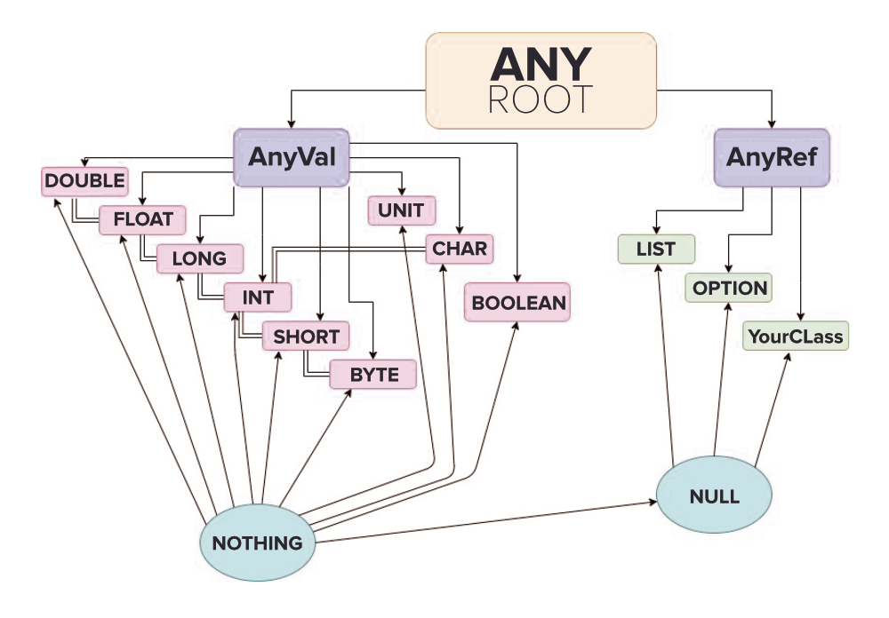
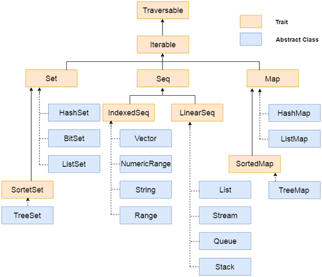
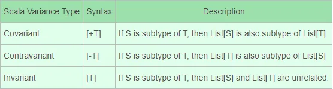
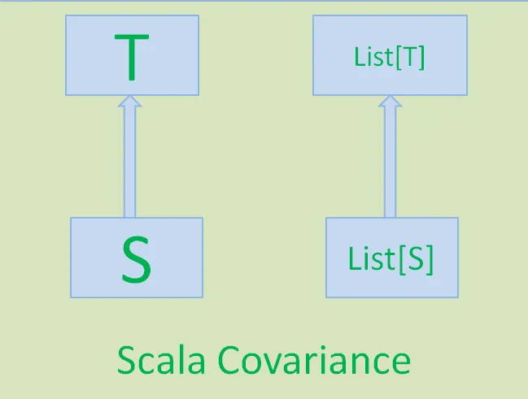
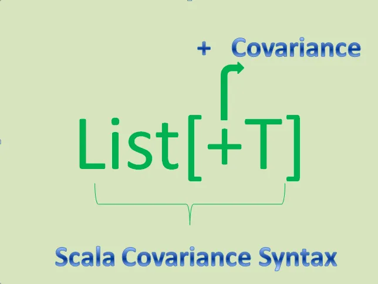
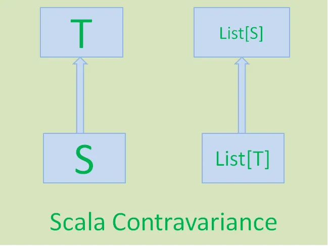
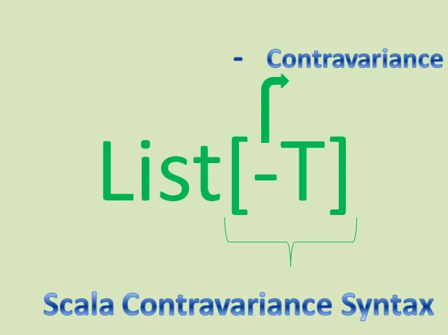

#  **Scala Types Hierarchy**


# **Scala Collections Hierarchy**


# **Variances**

Variance is all about sub-typing. It tells us if a type constructor is a subtype of another type constructor. 
Variance defines inheritance relationships of parameterized types(types that have parameters within them).

Scala supports three types of variance:


### Invariance types
If S is subtype of T then List[S] and List[T] don’t have inheritance relationship or sub-typing. 
That means both are unrelated.

Generic classes in Scala are invariant by default. This means that they are neither covariant nor contravariant.

### Covariance types
If S is subtype of T then List[S] is a subtype of List[T].
This kind of inheritance relationship between two parameterized types is known as Covariance.
 

### Contravariance types
If S is subtype of T then List[T] is a subtype of List[S].
This relation is contrary to the covariance relation.



# **CASE CLASSES**

Another Scala feature that provides support for functional programming is the case class. 
A case class has all of the functionality of a regular class, and more. 
When the compiler sees the case keyword in front of a class, it generates code for you, with the following benefits:
```
case class Person(name: String, relation: String)
```

### "new" not needed before Person
```
val christina = Person("Christina", "niece")
christina: Person = Person(Christina,niece)
```
As discussed in the previous lesson, this works because a method named apply is generated inside Person’s companion object.

### No mutator methods

### copy method
A case class also has an automatically-generated copy method that’s extremely helpful when you need to perform the process of 
a) cloning an object and 
b) updating one or more of the fields during the cloning process. 
As an example, this is what the process looks like in the REPL:
```
case class BaseballTeam(name: String, lastWorldSeriesWin: Int)
defined class BaseballTeam

val cubs1908 = BaseballTeam("Chicago Cubs", 1908)
cubs1908: BaseballTeam = BaseballTeam(Chicago Cubs,1908)

val cubs2016 = cubs1908.copy(lastWorldSeriesWin = 2016)
cubs2016: BaseballTeam = BaseballTeam(Chicago Cubs,2016)
```

As shown, when you use the copy method, all you have to do is supply the names of the fields you want to modify during 
the cloning process.

Because you never mutate data structures in FP, this is how you create a new instance of a class from an existing instance. 
This process can be referred to as, “update as you copy.”

### equals and hashCode methods
Case classes also have automatically-generated equals and hashCode methods, so instances can be compared:
```
case class Person(name: String, relation: String)

val christina = Person("Christina", "niece")
christina: Person = Person(Christina,niece)

val hannah = Person("Hannah", "niece")
hannah: Person = Person(Hannah,niece)

christina == hannah
res1: Boolean = false
```
These methods also let you easily use your objects in collections like sets and maps.

### toString methods
Finally, case classes also have a good default toString method implementation,
which at the very least is helpful when debugging code.

### The biggest advantage
While all of these features are great benefits to functional programming, as they write in the book, 
Programming in Scala (Odersky, Spoon, and Venners), 
“the biggest advantage of case classes is that they support pattern matching.” 
Pattern matching is a major feature of FP languages, and Scala’s case classes provide a simple way to implement pattern 
matching in match expressions and other areas.